# O-Spotlight for Omarchy

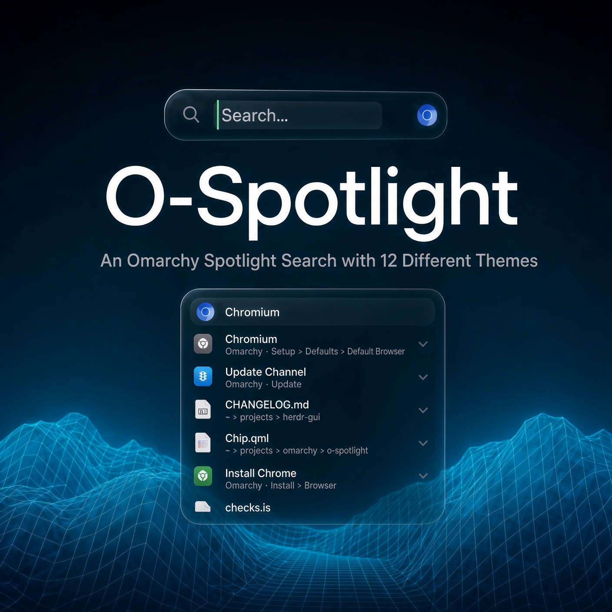

▶ **[Watch O-Spotlight in action](https://vimeo.com/1232122273)**

Search everything on Omarchy the way Spotlight does on a Mac. Press
**Alt+Space**, or click the magnifying glass in the top bar, and type: apps,
everything in the Omarchy menu, the top bar's panels, your themes, your files
and folders (by name, and by what's in them), plus math and unit conversions
as you type. Twelve distinct styles, and every one fully customizable.

* **Twelve styles.** Tahoe's Liquid Glass (the default), or Terminal, Command
  strip, Split preview, Tiles, Float, Drawer, Frosted, Island, Glow edge,
  Layered and Bento. They take their colors from your Omarchy theme, or from
  colors you pick, and all of them search, browse and answer alike.
* **Everything Omarchy.** Every submenu and action in the Omarchy menu is a
  result, including your own entries from `omarchy-menu.jsonc`: "theme",
  "docker", "screenshot", "nightlight". Picking one opens it in the Omarchy
  menu, or runs it the way the menu would. Wi-Fi, Bluetooth, Sound, Displays
  and Battery open the top bar's panels. Themes show their previews, and
  Return applies one.
* **Files like Spotlight.** Names of everything in your home folder, found as
  you type, with the kind, size, date and folder of each ("PNG image · 2.4 MB ·
  Today, 12:16 · Pictures"). Documents that *contain* what you typed come from
  LocalSearch, GNOME's file indexer, when it's running (Omarchy's Files app
  uses it). Hold Ctrl to see where a file is.
* **Answers as you type.** `1200*3+15%`, `15% of 80`, `sqrt 2`, `2pi`,
  `10 km to mi`, `72°F`, `1 gb in mib`, `255 to hex`. Return copies the answer.
* **Learns what you pick.** Results you open move up, and what you picked for
  a word comes first when you type it again. Kept only on your computer.
* **Browse views.** Applications as a grid (your most-used apps on top, then
  everything A–Z, by category), Files (suggestions and recents), Actions
  (everything Omarchy can do, by menu) and Clipboard (Omarchy's clipboard
  history; Return pastes it into the window you came from).
* **Keyboard first.** Arrow keys, Return, Esc, Ctrl+1–4 for the views, ↑ in
  an empty field for your last searches, → to accept the completion ("chr"
  then "omium — Open").

## Screenshots

**Tahoe**, the default: one piece of Liquid Glass over your desktop.

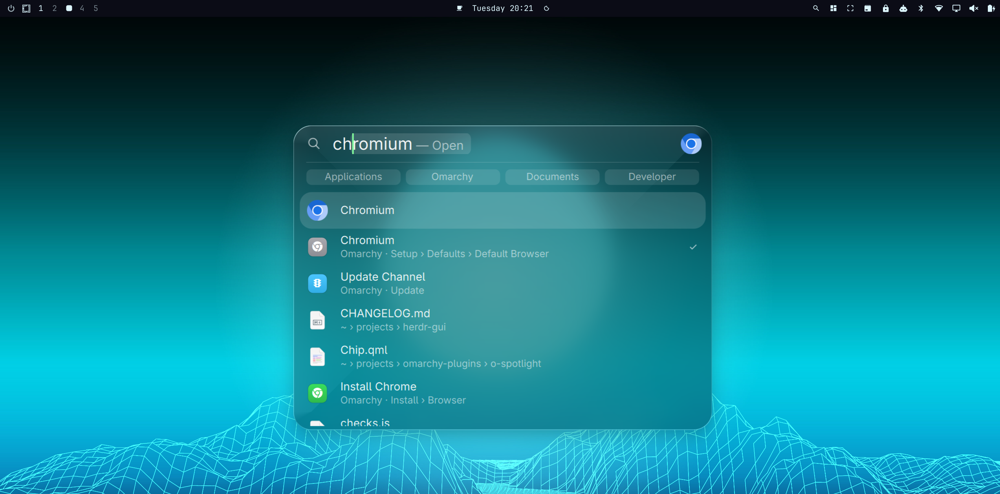

With nothing typed, the four views wait beside the bar:

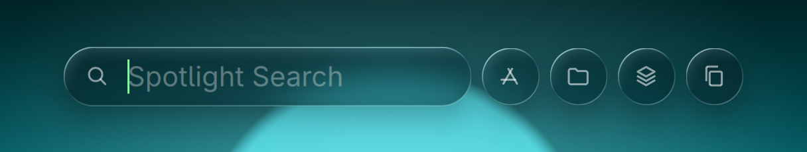

**Terminal**, all monospace in a box-drawn frame:

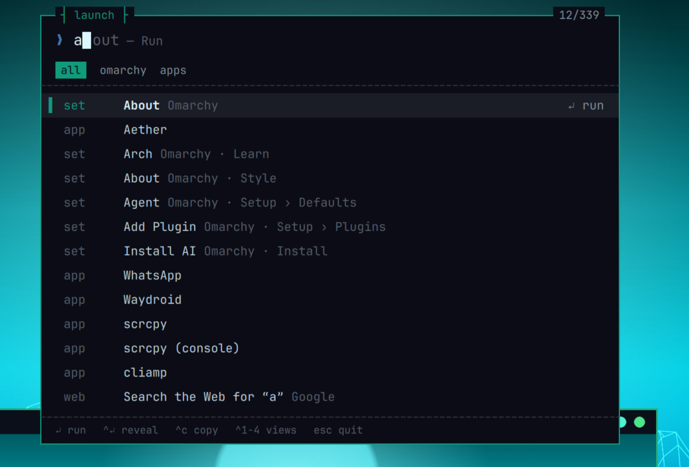

**Command strip**, docked under the top bar, with results side by side:

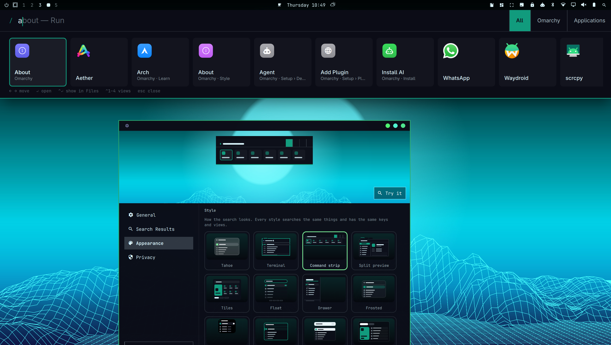

**Split preview**, with the selected result and what you can do with it:

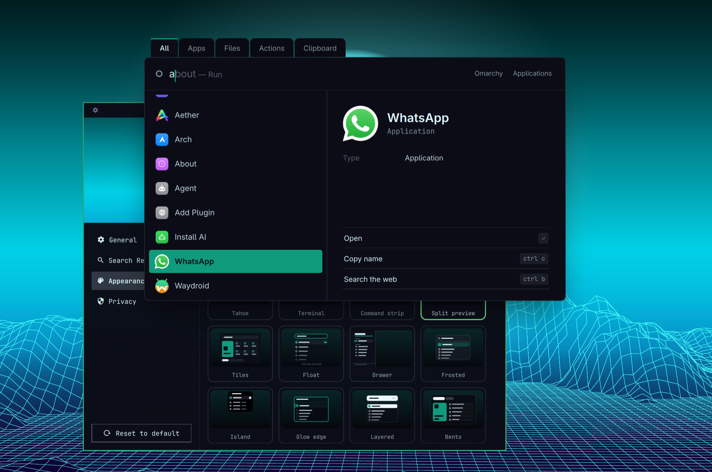

**Bento**, with the Top Hit as a hero card:

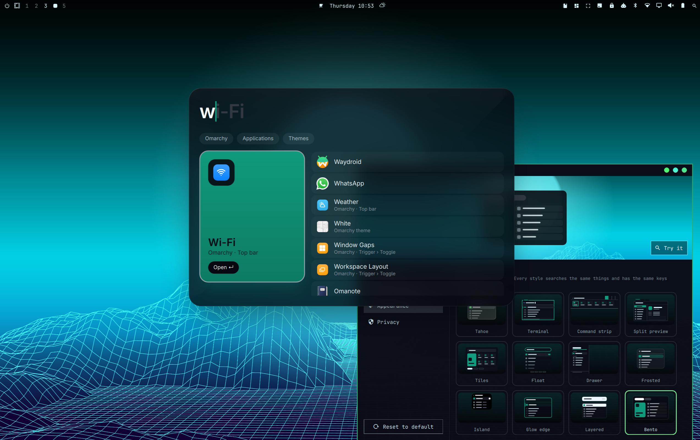

**All twelve styles**, in the colors of the theme they follow:

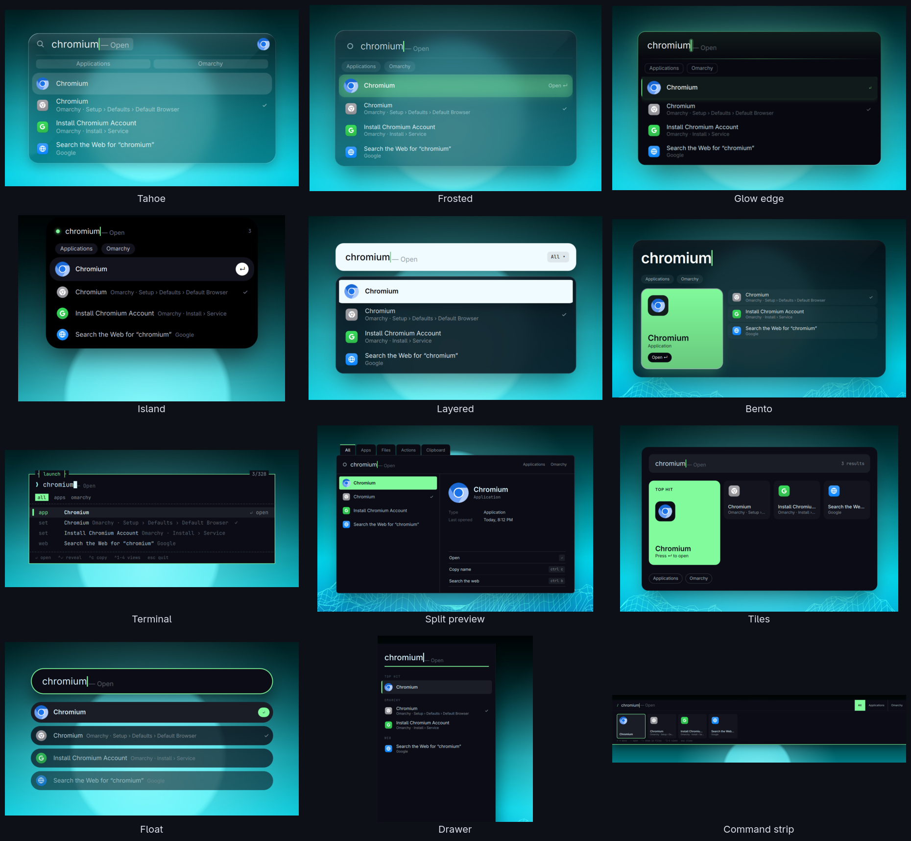

**Applications**, **Actions** and a **conversion** (in Tahoe):

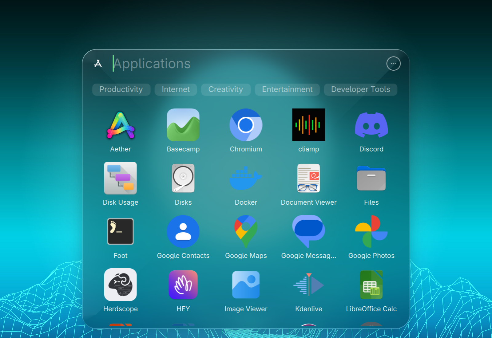

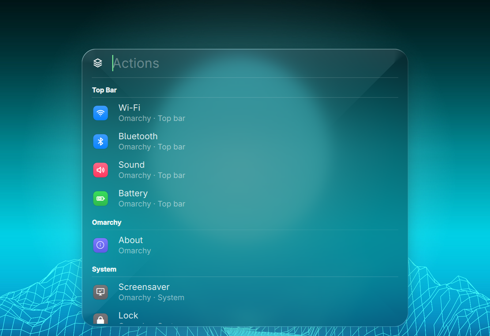

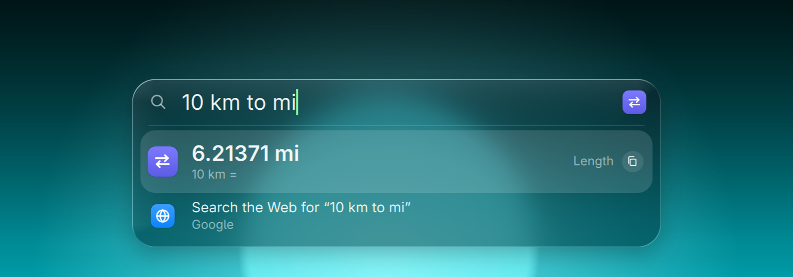

**Settings**, where you pick a style, drawn in your colors:

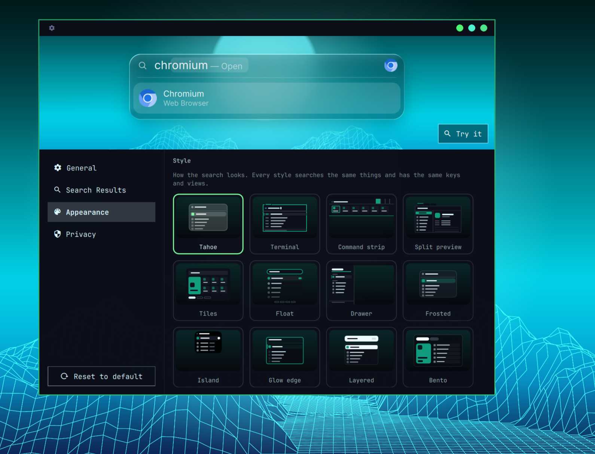

## Requirements

Omarchy 4 (Quattro): the Omarchy shell on Quickshell 0.3, and Hyprland 0.56 or
newer with its Lua configuration. Everything else it uses comes with Omarchy:
`fd` for file names, `uwsm-app` and `gtk-launch` to start apps, `wl-copy` for
copying, and Python 3 for its small file helper. LocalSearch (file contents)
comes with Omarchy's Files app; without it, only names are searched. Nothing
to build, and no setup step.

## Install

```bash
omarchy plugin add https://github.com/marcho78/o-spotlight.git --enable
```

That's all. Your Hyprland config is not touched: O-Spotlight registers its
shortcut with Hyprland while it runs and takes it back out when you disable
it. Enabling puts the magnifying glass on the right of the bar; move it with
`omarchy bar move marcho78.o-spotlight --section left`. Omarchy keeps a plugin
with a bar icon on for as long as the icon is in the bar, so to keep
O-Spotlight without the icon, turn off **Show O-Spotlight in the top bar** in
its settings: the icon then takes no space.

The shortcut is **Alt+Space**, because every Super+Space combination already
does something in Omarchy (Super+Space is the Omarchy menu). For the Mac
habit, free Super+Space in `~/.config/hypr/bindings.lua`
(`hl.unbind("SUPER + SPACE")`) and set O-Spotlight's shortcut to
`SUPER + SPACE` in its settings.

## Use

| To | Do |
|---|---|
| Search | **Alt+Space**, or click the magnifying glass in the top bar, and type |
| Open the Top Hit | Return (it's selected as you type) |
| Pick another result | ↑ ↓, Tab, Page Up/Down, or the mouse |
| Accept the completion | → |
| Show a file in Files | Ctrl+Return or Ctrl+R |
| See where files are | Hold Ctrl |
| Copy a result (a path, an answer, a clipboard item) | Ctrl+C, or its copy button |
| Search the web for what you typed | Ctrl+B, or the last row |
| Only one kind of result | Click its chip, or type `/pdf`, `/images`, `/apps`… and Return (Esc or Backspace takes it off) |
| Your last searches | ↑ in an empty field |
| Applications, Files, Actions, Clipboard | Ctrl+1 … Ctrl+4, or the view buttons |
| Back out | Esc: a chip or view first, then the text, then the search |
| Move it | Drag the search; it opens there next time |
| Settings | Right-click the magnifying glass, Ctrl+, in the search, or `omarchy-shell o-spotlight settings` |

Close the search and open it again within a few minutes and your last search
is still there, selected, so typing replaces it.

### From a terminal or your own bindings

```bash
omarchy-shell o-spotlight toggle               # or show, hide
omarchy-shell o-spotlight search "tokyo night"
omarchy-shell o-spotlight browse apps          # files, actions, clipboard
omarchy-shell o-spotlight settings
omarchy-shell o-spotlight set style bento      # any setting below
omarchy-shell o-spotlight reset                # every setting back to its default
omarchy-shell o-spotlight status
```

## Styles

Pick one in **Settings › Appearance › Style**, or with
`omarchy-shell o-spotlight set style <name>`. Every style finds the same
results, has the same keys and views, and opens results the same way; only
the look changes.

| Style | `style` | What it's like |
|---|---|---|
| Tahoe | `tahoe` | Liquid Glass that grows from a capsule into the results, like macOS Tahoe (the default) |
| Terminal | `terminal` | fzf in a box-drawn frame, all monospace: a `❯` prompt, a block cursor, the kinds as a filter line, the keys along the bottom, and the views as `[1]apps [2]files …` |
| Command strip | `strip` | Docked under the top bar, the full width of the screen; results scroll sideways as cards (→ and ← at the ends of the text move through them), and the views, or the kinds found, are segments fused to the right end |
| Split preview | `split` | Results on the left; the selected one on the right with what it is, where, when you last opened it and what you can do with it; the views as folder tabs |
| Tiles | `tiles` | The Top Hit as a card in your accent beside a grid of tiles, the kinds as pills; the views as big tiles until you type |
| Float | `float` | No panel: a pill with an accent ring, and every result floating on its own, fading down the list; the views as keys inside the pill |
| Drawer | `drawer` | The full height of the screen at the left, large type on an accent rule, results grouped by kind like classic Spotlight (click a group's title to keep only it) |
| Frosted | `frosted` | Heavy blur tinted with your colors, an inner highlight, a soft glow under the selection |
| Island | `island` | A black pill that grows out of the top bar, with a dot in your accent |
| Glow edge | `glow` | A rim lit in your accent, and a bar of light on the selected row |
| Layered | `layered` | The field and the results as separate sheets; "All ▾" in the field picks a view or one kind |
| Bento | `bento` | An oversized query, the Top Hit as a hero card with its actions, the rest beside it; the views as four cards |

**Colors.** Every style but Tahoe follows your Omarchy theme: background, text
and accent are the theme's, and the shades in between are mixed from them, so
a style changes with your theme, dark or light. Turn off **Follow my Omarchy
theme** to pick your own background, surface, text, secondary text and accent
(they start from your theme's): click a color's chip for a color picker (a
saturation and brightness square, a hue bar, the hex, and swatches from your
theme), or type the hex. Colors apply as you pick them. Tahoe keeps its own
glass and takes the theme's accent (see `glass`, `appearance`, `selection` and
`highlight` below).

## Settings

Open them from the magnifying glass (right-click), with Ctrl+, in the search,
or with `omarchy-shell o-spotlight settings`. They apply immediately and are
saved on O-Spotlight's entry in `~/.config/omarchy/shell.json`, keeping only
what differs from the defaults in `Defaults.js`.

| Setting | Default | Values |
|---|---|---|
| `shortcut` | `ALT + SPACE` | any modifiers and a key, or empty |
| `barIcon` | `true` | show the magnifying glass in the top bar |
| `style` | `tahoe` | `tahoe`, `terminal`, `strip`, `split`, `tiles`, `float`, `drawer`, `frosted`, `island`, `glow`, `layered`, `bento` (see [Styles](#styles)) |
| `colors` | `theme` | `theme` (the styles follow your Omarchy theme), `custom` (the colors below) |
| `customBackground`, `customSurface`, `customText`, `customMuted`, `customAccent` | the designs' Tokyo Night | `#rrggbb`, used when `colors` is `custom` |
| `apps`, `omarchy`, `themes`, `calculator`, `files`, `contents`, `web`, `clipboard` | `true` | what's searched (and whether the Clipboard view is there) |
| `webEngine` | `google` | `google`, `duckduckgo`, `bing`, `brave`, `kagi`, `startpage`, `ecosia` |
| `glass` | `liquid` | Tahoe's glass: `liquid`, `frosted`, `solid` |
| `appearance` | `auto` | Tahoe's: `auto` (from your theme), `light`, `dark` |
| `selection` | `glass` | Tahoe's: `glass` (Tahoe), `accent` (the highlight color, like older macOS) |
| `highlight` | `accent` | Tahoe's: `accent` (your theme's), `blue`, `purple`, `pink`, `red`, `orange`, `yellow`, `green`, `graphite`, or `#rrggbb` |
| `appsView`, `filesView` | `grid` | `grid`, `list` (Terminal and Split preview always list) |
| `reduceMotion` | `false` | fade instead of the springy open and close |
| `learn` | `true` | learn from what you open |
| `excluded` | none | folders never searched |
| `offsetX`, `offsetY` | `0` | where you dragged the search, from the middle |

A shortcut another binding already uses is left alone, and the settings window
says which (and anything Hyprland refused). A shortcut needs a modifier, unless
it's a function or media key: on its own, a key would stop working in every
app.

O-Spotlight uses SF Pro when it's installed, else Inter, else Adwaita Sans
(GNOME's Inter-based font, which Omarchy has), so it reads like a Mac.

## How it works

O-Spotlight is QML and JavaScript, a small Hyprland Lua file, and a small
Python helper for its files; nothing is built on your machine. It runs inside
the Omarchy shell: a service with the search engine and the settings, an
overlay that draws the search on the focused display, and the icon in the bar.

* **Apps** are the same ones the Omarchy launcher shows: every desktop entry,
  less those Omarchy hides (its `launcher.hides` list, and entries marked
  Hidden, NoDisplay or for another desktop, found by Omarchy's own scanner).
  They start the way the launcher starts them, with `uwsm-app -- gtk-launch`,
  and "Launching…" shows if a window is slow to appear.
* **The Omarchy menu** is read from Omarchy's `omarchy-menu.jsonc` and your
  `~/.config/omarchy/extensions/omarchy-menu.jsonc`, merged as the menu merges
  them, with the menu's own `when:` and `checked:` checks so both show the
  same rows. Picking a result asks the menu to open it:
  `omarchy menu summon <id>`.
* **Files** come from `fd` a moment after you stop typing (hidden and
  git-ignored files skipped, like Spotlight skips system files), and from
  `localsearch search` for contents. One `stat` fills in sizes and dates.
  Pictures of files are the thumbnails Files already made, or the image
  itself, once `stat` has said it's a regular file of a sane size;
  O-Spotlight never writes thumbnails.
* **Everything is ranked together**: how well the name matches (from the start
  of a word, as in Spotlight, never scattered letters), what kind of thing it
  is (apps first), and what you've opened before. Results that arrive later
  never move the Top Hit you're looking at.
* **The glass** is Stage Control's Liquid Glass shader over one picture of the
  screen taken as the search opens, blurred once. Omarchy turns Hyprland's
  blur off, so the glass does its own. Frosted, Layered and Bento blur the
  same picture.
* **Styles** are files in `styles/`, loaded only when picked. The search
  itself stays in `Spotlight.qml`: what you typed, the results, the
  selection, the keys and opening a result are the same for every style,
  which only draws them. Their colors come from `Palette.js`, from the theme
  colors the Omarchy shell already has.
* `hypr/o-spotlight.lua` registers the shortcut as a message to the service
  over Hyprland's event socket (`hl.dsp.event`), a layer rule that leaves the
  animation to O-Spotlight, and a window rule that floats the settings window.
  The service runs it with `hyprctl eval` when the shell starts, after every
  Hyprland config reload (which clears runtime additions), and when you change
  the shortcut; disabling O-Spotlight removes it all.

## Security

O-Spotlight runs as unsandboxed code in the Omarchy shell, like every shell
plugin, so here is exactly what it does.

**No network, no root, nothing downloaded or compiled.** The web search row
and Ctrl+B hand a search URL to your browser; O-Spotlight itself never
connects anywhere.

**Programs.** Every command runs by absolute path with an argument list, never
through a shell, except the two bash runs noted below:

| Program | Why |
|---|---|
| `/usr/bin/python3 -I -S` with `bin/o-spotlight-files` | every file O-Spotlight reads or writes, apart from the pictures it shows (see **Files** and **Pictures**) |
| `/usr/bin/fd` | find file and folder names under your home folder (files and folders only: no links, pipes or devices) |
| `/usr/bin/localsearch` | find documents by their contents (`localsearch search`) |
| `/usr/bin/stat` | sizes and dates of the files on screen and of recent files; whether each picture is a regular file of a sane size before it's shown (see **Pictures**) |
| `/usr/bin/find` | list your themes |
| `/usr/bin/bash` | run Omarchy's own `shell/services/hidden-entries.sh` from `/usr/share/omarchy`, and the Omarchy menu's `when:`/`checked:` checks (see below) |
| `/usr/bin/hyprctl` | read Hyprland's bindings; register and remove the shortcut and rules; bring the settings window forward |
| `/usr/bin/uwsm-app` with `/usr/bin/gtk-launch` or `/usr/bin/xdg-open` | start an app, or open a file or a web page (http and https only), in its own scope like the Omarchy launcher does |
| `/usr/bin/omarchy` | `menu summon <id>` for Omarchy menu results, `theme set <name>` for themes |
| `/usr/bin/omarchy-shell` | open a top bar panel (`shell summon omarchy.network`), and say "Copied" on the OSD when Return copies an answer |
| `/usr/bin/omarchy-clipboard-paste-text`, `/usr/bin/omarchy-clipboard-paste-file` | paste or copy a Clipboard view item, as Omarchy's clipboard does |
| `/usr/bin/gdbus` | show a file in Files (`org.freedesktop.FileManager1.ShowItems`) |
| `/usr/bin/wl-copy` | copy a path or an answer, handed over on its stdin (never in its command line, where other accounts could read it) |
| `/usr/bin/readlink` | find your wallpaper (`~/.local/state/omarchy/current/background`) for the settings window's preview |

Program paths are fixed in the code, never taken from `PATH` or other
environment variables. Every call whose output O-Spotlight reads starts under
`/usr/bin/setsid`, so it is its own process group. Its output is counted in
bytes as it arrives against a fixed budget (8 KiB to 24 MiB depending on the
call) and each has a deadline of 2 to 8 seconds; going over either ends the
whole group with `/usr/bin/kill`. A search that's still running when you type
on is stopped the same way, and so is anything still running when O-Spotlight
is turned off. Output is taken in so that no character is split: the file
helper prints only ASCII, and `fd`'s paths (NUL-ended) and the lines of
`stat`, `find`, `readlink` and Omarchy's hidden-apps script arrive one whole
record at a time, each at most a path long.

**The menu's checks.** The Omarchy menu hides some rows and marks others with
shell tests in its menu files (`when:` and `checked:`, such as "is Docker
installed"). To show the same rows, O-Spotlight runs those tests in one bash
batch built by Omarchy's own recipe (`MenuModel.guardScript`), which reports
only yes or no per row. The tests come from the menu files only; nothing you
type and no result ever reaches them. Omarchy's own rows (from its root-owned
`/usr/share/omarchy` menu file) run with no startup files, in a fresh
environment: `PATH=/usr/bin`, `OMARCHY_PATH=/usr/share/omarchy`, and of yours
only what the tests read (home, user, language, XDG folders and session,
Wayland and D-Bus addresses), so no exported function or shell option of
yours comes along. Omarchy's hidden-apps script runs the same way. Rows from
your own `~/.config/omarchy/extensions/omarchy-menu.jsonc` run the way the
Omarchy menu runs them (a login shell, your `PATH`), since they call your own
tools; they're your configuration, and the Omarchy menu runs every row that
way each time it opens. A test longer than 8 KiB isn't run at all (never cut
short), and its row stays hidden; each menu file is read up to 5,000 rows.

**What it passes along.** Your query reaches `fd` and `localsearch` as
separate arguments after `--`, so it can never be read as an option. Omarchy
menu ids, theme names, app ids, panel ids and file paths are checked against
plain-character patterns before they're used; paths must be absolute with no
control characters, and a file URI for Files has every special character
escaped. Web searches are percent-encoded, and only http and https addresses
are opened; an address you type with a control character in it isn't one.

**Files.** `bin/o-spotlight-files` does all of O-Spotlight's reading and
writing of files, apart from the pictures it shows (below). It reaches every
file from `/` one directory at a time without following symbolic links,
through directories only their owner can write to, and reads only a regular
file with a single link, owned by you (Omarchy's own files: by root), and no
bigger than a fixed cap, read in pieces up to that cap. Anything else is
refused. What it read reaches the shell as one escaped JSON string, plain
ASCII.

* **It writes one file:** `~/.local/state/marcho78.o-spotlight/history.json`,
  at most 8 MiB: what you've opened, how often and when, and the first 40
  characters of the searches you opened each from (so that search finds it
  first next time), and whether you've seen the welcome. It writes a new file
  created exclusively beside it, syncs it, then renames it over the old one;
  the folder is created only you can open (0700), and the file only you can
  read (0600). The temp file of a write that was stopped is removed a minute
  later. Nothing is written until the file has been read (or found missing),
  so a read that fails never costs you your history. Turn off **Learn from
  what I open** to stop recording and **Clear history** to empty it. Your
  last searches (↑) are kept only in memory.
* **It reads, without changing:**
  * Omarchy's menu, at most 1 MiB, and `launcher.hides`, at most 64 KiB, both
    root's, from `/usr/share/omarchy/default/omarchy`;
  * your menu additions, `~/.config/omarchy/extensions/omarchy-menu.jsonc`, at
    most 1 MiB;
  * the current theme's name, `~/.local/state/omarchy/current/theme.name`;
  * your recent files list, `~/.local/share/recently-used.xbel`, at most 4 MiB;
  * the Omarchy clipboard history,
    `~/.local/state/omarchy/clipboard-history.json`, at most 8 MiB, only when
    the Clipboard view is shown and again right before an item is pasted or
    copied from it (Omarchy's paste goes by the item's place in the history,
    so it's looked up at the last moment); never mixed into search results.
* **Pictures** are opened by Qt, by their path: the thumbnails Files already
  made in `~/.cache/thumbnails`, images among your results, theme previews,
  clipboard images, icons that apps name by path, and your wallpaper. None
  reaches Qt until `stat` has said it's a regular file (not a link, a pipe or
  a device) no bigger than its cap: 64 MiB, thumbnails 8 MiB, icons 4 MiB.
  They're checked again every time the search opens, and each is decoded at
  the size it's shown. Icons named by apps come from your icon theme, as
  everywhere in the shell.
* **Settings** are stored on O-Spotlight's entry in
  `~/.config/omarchy/shell.json` by the Omarchy shell.

Everything read is checked before use (types, sizes, counts), so a damaged or
hand-edited file can't feed bad data onwards.

**Text.** Every piece of text O-Spotlight draws (file names, clipboard items,
app names, menu labels) is plain text (`Text.PlainText`); the calculator parses
math itself and never evaluates code. What you type, menu ids, theme and file
names are only ever looked up in tables that have no JavaScript names in them,
so a search for `__proto__` or a menu id `constructor` is just text.

**The keyboard.** While the search is open it takes the keyboard, like any
launcher, and gives it back the moment it starts to close, so a paste or the
Omarchy menu lands where it should.

**Limits.** Like any shell plugin, O-Spotlight trusts the programs above and
Omarchy's own files; anything already running as you could change its files
or your Omarchy menu, or swap a picture for something else between its check
and its loading (at worst stalling picture loading, which such a program
could do anyway).

## Development

```bash
tests/run          # every test: matching, calculator, menu, files, ranking, settings, styles and colors, the Hyprland module, and the file helper (needs node, lua and python3)
shaders/build      # recompile the glass shader (needs qt6-shadertools)
```

The Omarchy shell caches plugin QML, and O-Spotlight stays loaded, so after
changing QML run `omarchy restart shell` (a symlinked checkout isn't watched
at all).

## Known limitations

* The glass shows a picture of the screen taken when the search opens, so a
  video playing behind it doesn't move while it's open.
* The search can be dragged (and opens where you left it; **Put it back in
  the middle** in its settings resets that) but not resized. The Command
  strip, the Drawer and the Island are docked, so they stay put.
* Terminal and Split preview always show Applications and Files as a list:
  their layouts have no grid. The Island stays black whatever the colors;
  only its accent follows them.
* Files O-Spotlight refuses to read (a symbolic link, say, or a recent files
  list over 4 MiB) are simply left out, with a note in the shell's log. A
  picture that isn't a regular file of a sane size (a link, say) shows as its
  file's icon instead. Symbolic links, pipes and devices aren't search
  results; the files and folders they point to are.
* No Quick Look (Space): Omarchy has no quick previewer. Space types a space.
* LocalSearch indexes what GNOME's indexer is set to index, and skips folders
  that contain a `.git` folder; file *names* there are still found by `fd`.
* No actions with parameters, quick keys, currency conversion or dictionary,
  which in macOS come from Apple's apps and services.

## Uninstall

```bash
omarchy plugin remove marcho78.o-spotlight
```

The shortcut and rules leave Hyprland with it, and its settings go with its
shell.json entry. To also forget what it learned, delete its file (and the
temp file of a save that was stopped part way, if there is one), then its
folder:

```bash
rm -f ~/.local/state/marcho78.o-spotlight/history.json ~/.local/state/marcho78.o-spotlight/.history.json.*.tmp
rmdir ~/.local/state/marcho78.o-spotlight
```

## Changelog

What changed in each version is in [CHANGELOG.md](CHANGELOG.md).

## License

MIT. See [LICENSE](LICENSE). The Liquid Glass shader comes from
[Stage Control](https://github.com/marcho78/omarchy-stage-control) (same author,
MIT); the Omarchy menu reading follows Omarchy's own `MenuModel.js` (MIT).
